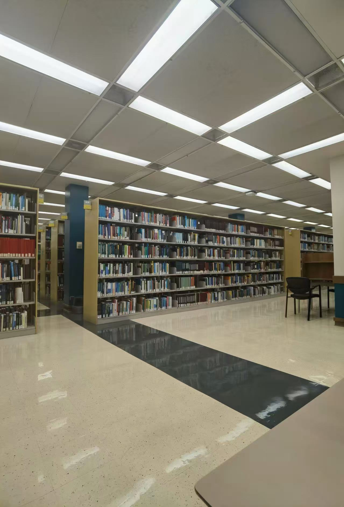

My first few weeks in the MDS program have been busy. There are many new courses, assignments, and tools, so I am still getting used to the pace.

One big change for me is using Git, GitHub, R, Python, and Quarto much more often. My undergraduate background is in Mathematics, so some of these tools are still new to me.

The first few weeks have been challenging, but I am slowly getting more comfortable with the program. I hope I can become faster with the technical tools and focus more on data science as the program continues.

